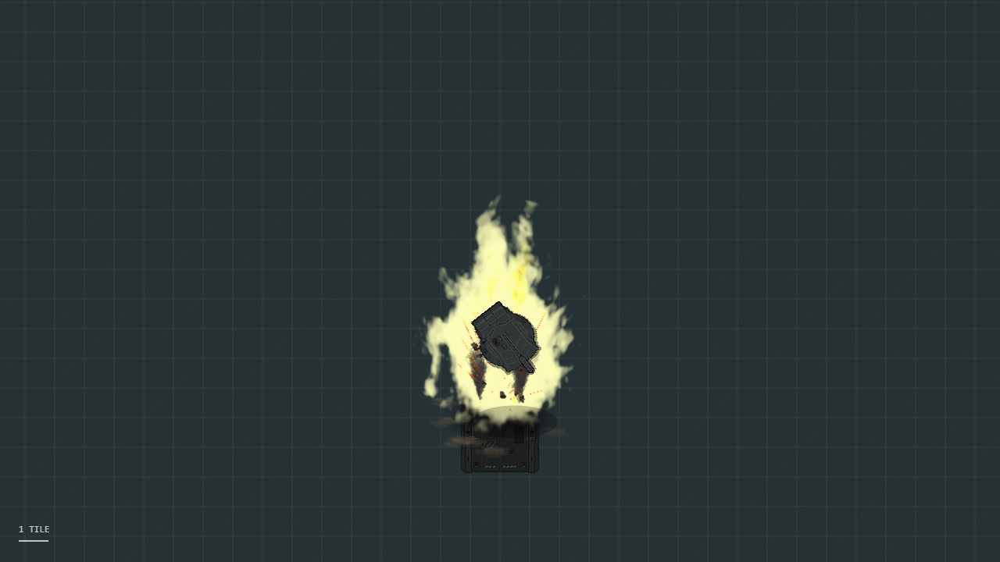

# Tank cook-off showcase

Use a local development server with one player connected and a clear area around the player. Open the server C# scripting window with `scsi` in the in-game console, then paste the complete contents of `showcase.csx` into its input and execute it. The script spawns the Longstreet, Cheetah 2A and Hobelar side by side, then destroys their hardpoints and hull after two seconds through the normal integrity API.

For a crew demonstration, change `Timer.Spawn(2000, ...)` to a longer delay before running the script, then occupy the driver/gunner seats or stand inside a tank. At rupture, occupants are forcibly unbuckled, removed from containers and pulling relationships, moved outside the hull and thrown outward. Cook-off does not apply a new scripted instant-kill or damage value to occupants; normal projectile damage and throwing/collision behavior still apply.

Review these behaviors in-game:

- Ignition at zero hull integrity, followed by hatch vents, turret rupture, landing debris and persistent wreck fire.
- The correct turret sprite on all three tank families and the Yutani variant. The unarmed engineering vehicle is excluded.
- Entry attempts fail from ignition onward, including entry that began before ignition. Existing occupants can leave during the warning period, even if the tank was locked.
- Remaining occupants, including buckled crew and unconscious bodies, are ejected at rupture. Driver and gunner controls and camera targets clear through the usual unbuckling handlers.
- Hull, mechanical failure, lock and replacement-hardpoint repairs cannot restore the wreck, including work started before ignition.
- Leaving and returning to PVS shows the current wreck state instead of restarting the rupture.
- Marked 70 mm/84 mm anti-armor rockets and APFSDS/HEAT tank shells can cause critical ignition on damaging direct hits. The default probability is 15%; splash and unmarked projectiles do not roll it.

The preview image is from the browser visualization reviewed during development, not an in-game capture. It illustrates turret rupture; it does not verify occupant ejection.

The preview uses the repository's tank sprites; their existing RSI attribution applies. The procedural shader is original CMU code under CC0-1.0.
